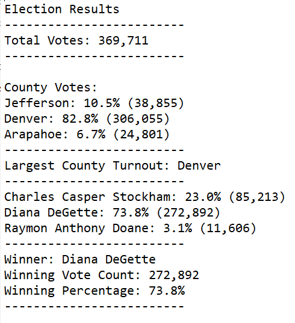

# Election_Analysis

## Overview of Election Analysis

The purpose of this project is to report and analyze the results of an election. Data was imported from a CSV file and analyzed using Python. In this analysis, I've taken a list of over 300,000 votes, and identified the candidate election winner, produced vote counts, and county turnouts. Below are the results.

## Election-Audit Results

### Election Results Snapshot

Election-Audit Results:

- How many votes were cast in this congressional election?
- Provide a breakdown of the number of votes and the percentage of total votes for each county in the precinct.
- Which county had the largest number of votes?
- Provide a breakdown of the number of votes and the percentage of the total votes each candidate received.
- Which candidate won the election, what was their vote count, and what was their percentage of the total votes?

   *369,711
  Provide a breakdown of the number of votes and the percentage of total votes for each county in the precinct.

## Election Audit Summary

There is a statement to the election commission that explores how this script can be used for any election, with two examples for modifying the script.

Deliverable 3: A written Analysis of the Election Audit
